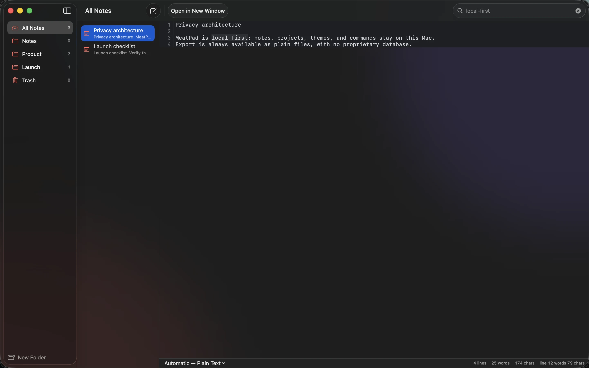
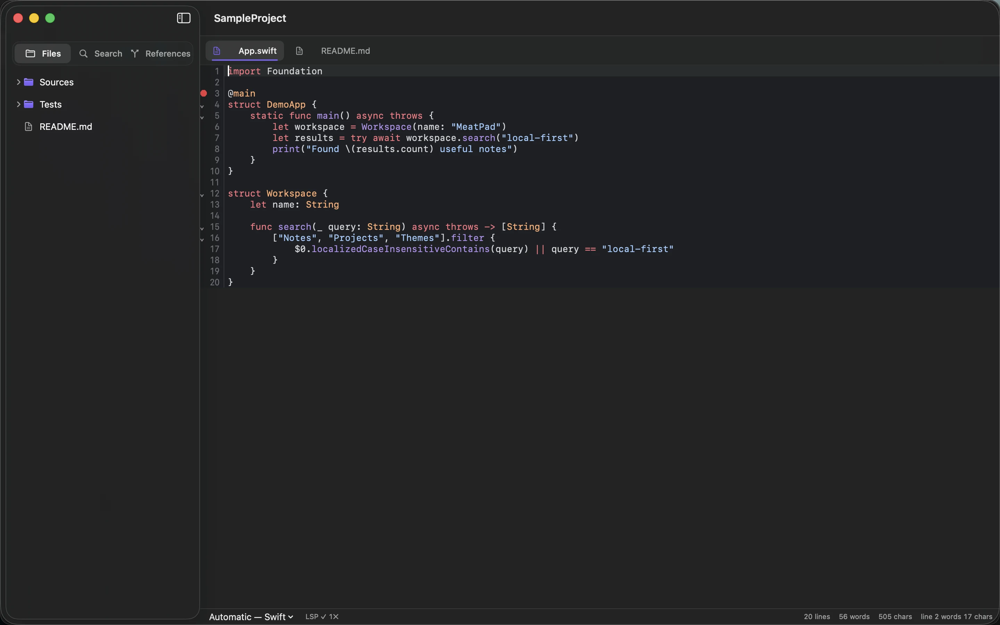
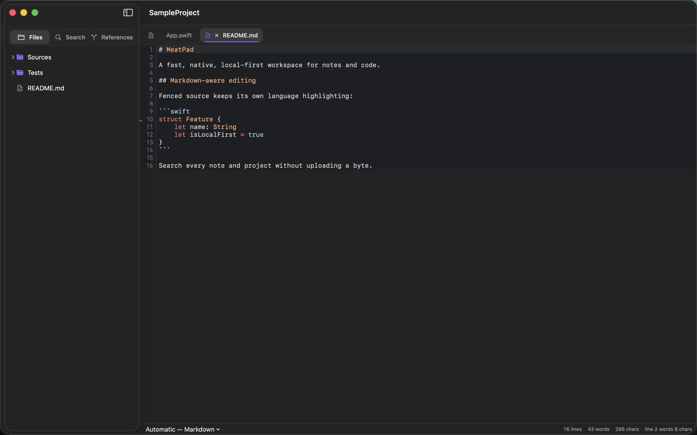
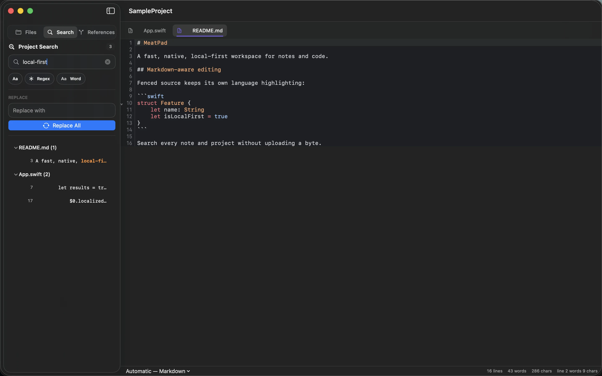
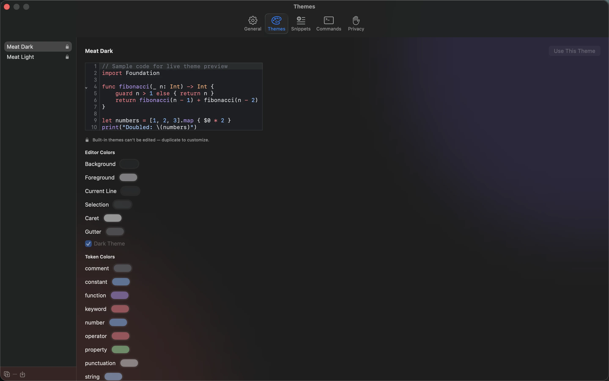
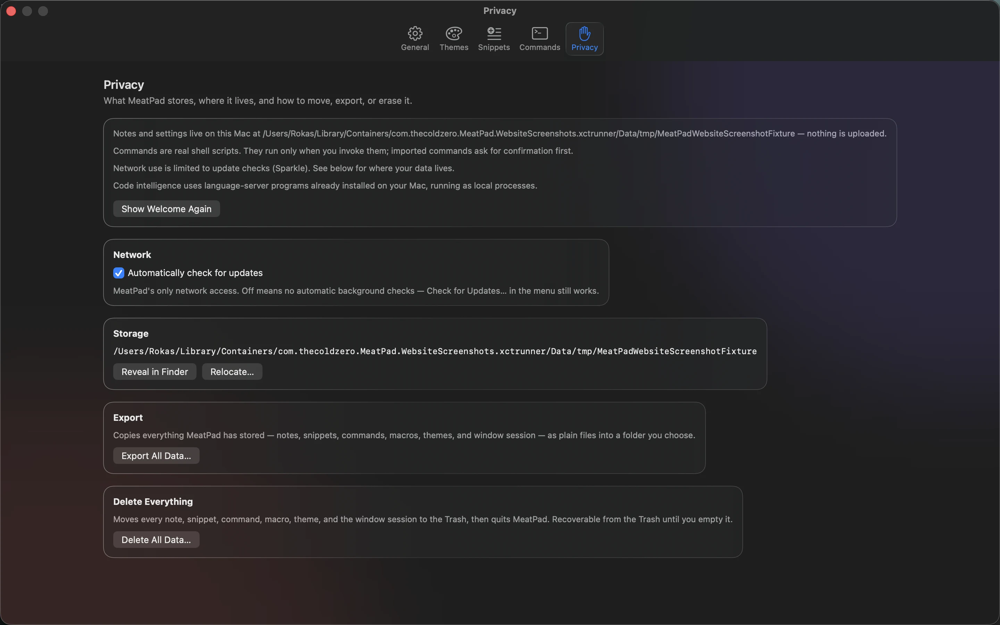

<p align="center">
  
</p>

<h1 align="center">MeatPad</h1>

<p align="center">
  <b>Start with a note. Stay for the editor.</b><br>
  A local-first home for quick notes, Markdown, and real code projects — native for macOS.
</p>

<p align="center">
  macOS 14+ · No account · Plain files · SwiftUI · Preview 0.9<br>
  <a href="https://graphicmeat.com/meatpad.html">graphicmeat.com/meatpad</a>
</p>

---



MeatPad is one focused app with two ways to think: a notebook for fast, unstructured thought, and a serious project editor when a folder of real code lands in front of you. Everything stays on your Mac as ordinary files — no sync engine, no proprietary database, no browser.

## Features

### Notes
- **Full-text search** — find the sentence, not the file. Matches highlighted, results update live in the same native window.
- **Notes are unsaved buffers** — open the app and type; nothing to name or save first.
- **Folders and trash** — light structure that stays out of the way.
- **Plain text on disk** — export any time as ordinary files.

### Project editor



Open a folder and MeatPad becomes a real editor:

- **Project workspace** — file tree, tabs, distraction-free native window.
- **Syntax highlighting** — TextMate-grammar based, with language auto-detection.
- **Real code folding** — collapse syntax-defined regions, fold everything, reopen exactly where you were.
- **Project-wide search & replace** — search every file, inspect grouped matches, replace across the project from one panel.
- **Completion** — local completions from the open project, snippets, language keywords, and optional language-server results.
- **Snippets, multi-caret, macros** — editor fundamentals, finished.

### Markdown



Write prose and fenced code in one real editor. Markdown structure and embedded languages stay legible, with line numbers and native text behavior.

### Language server support



Your language server. Your machine. No cloud middleman. The direct-download build detects servers already installed on your Mac and connects projects to diagnostics, completion, hover, definition, references, document symbols, and rename:

| Language | Server |
|---|---|
| Swift | SourceKit-LSP |
| Rust | rust-analyzer |
| TypeScript / JavaScript | typescript-language-server |
| Python | Pyright |

If a server is absent, ordinary editing and local completion keep working. MeatPad never uploads code to provide editor intelligence.

### Themes



- Built-in themes, or tune the editor palette token by token — background, text, comments, keywords, strings, numbers, types, and more.
- Live preview, no restart.
- TextMate `.tmTheme` import.

### Privacy



- **Local-first** — notes, projects, themes, and commands stay on this Mac. No account, no telemetry service.
- **Export on demand** — take notes and settings out as normal files.
- **Imported commands start untrusted** — review the script, working directory, input, environment, and timeout before it runs.
- **Deletion is deliberate** — destructive actions are visible, scoped, and confirmed.

### Localized

English, Deutsch, Français, Español, Italiano, 日本語, 한국어, 简体中文, Português (Brasil).

## Requirements

- macOS 14 Sonoma or later
- Distribution: notarized direct download with Sparkle auto-updates (the Mac App Store sandbox cannot execute user-installed language servers, so full LSP support belongs to the direct-download build)

## Building

```sh
brew install xcodegen
xcodegen generate
open MeatPad.xcodeproj
```

Core logic lives in [MeatPadKit](MeatPadKit/), a local Swift package. Run its tests with:

```sh
cd MeatPadKit && swift test
```

---

<p align="center">Made by <a href="https://graphicmeat.com">Graphic Meat</a></p>
